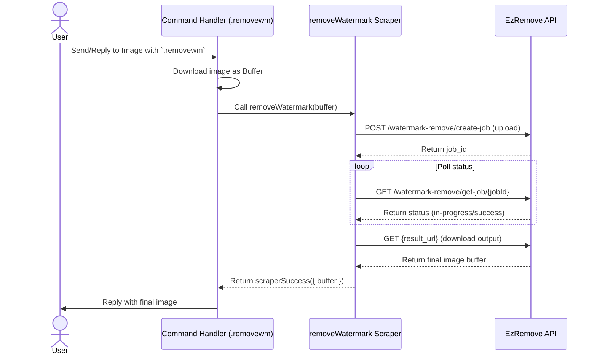

# Watermark Removal Feature Design

- **Date**: 2026-07-01
- **Feature Name**: Watermark Removal Command (`.removewm` / `.removewatermark`)

## Overview

This feature allows users to remove watermarks from images using the `ezremove.ai` API. It consists of a new scraper backend, a command handler in the `media` category, and corresponding localization keys.

## Architecture & Data Flow

## Implementation Details

### 1. Scraper (`src/infra/scrapers/removewm.ts`)

- **Function**: `removeWatermark(imageBuffer: Buffer, filename?: string): Promise<ScraperResult<RemoveWmData>>`
- **Steps**:
  1. Initialize connection / prepare headers.
  2. Perform multipart form-data upload to `https://api.ezremove.ai/api/ez-remove/watermark-remove/create-job` using standard `FormData` and `Blob`.
  3. Poll `https://api.ezremove.ai/api/ez-remove/watermark-remove/get-job/${jobId}` every 2 seconds (up to 30 attempts).
  4. Once `code === 100000` and `output` exists, fetch the resulting image URL with `responseType: "arraybuffer"`.
  5. Return the resulting `Buffer` wrapped in `scraperSuccess`.

### 2. Scraper Exports (`src/infra/scrapers/index.ts`)

- Export `removeWatermark` from `./removewm`.

### 3. Command Handler (`src/commands/media/removewm.ts`)

- **Trigger**: `.removewm` (aliases: `removewatermark`, `unwm`)
- **Logic**:
  - Verify that the message contains an image or quotes an image.
  - Download the image to a `Buffer` via Baileys' `downloadMediaMessage`.
  - Display a processing message (e.g., "Removing watermark...").
  - Call the `removeWatermark` scraper.
  - Send the returned buffer back to the chat.
  - Handle errors gracefully.

### 4. Translations (`src/data/lang/{en.json, id.json}`)

Add the following keys to support multiple languages:

- `media.removewm.desc`: Description of the command.
- `media.removewm.noImage`: Error shown when no image is targeted.
- `media.removewm.processing`: Message shown during API processing.
- `media.removewm.failed`: Message shown when the process fails.

## Verification & Testing Plan

1. **Lint & Type Check**: Ensure code passes formatting (`bun run format`), linting (`bun run lint`), and typechecking (`bun tsc`).
2. **Manual Chat Verification**: Run the bot locally and test the `.removewm` command with a watermarked image (both direct and quoted).
